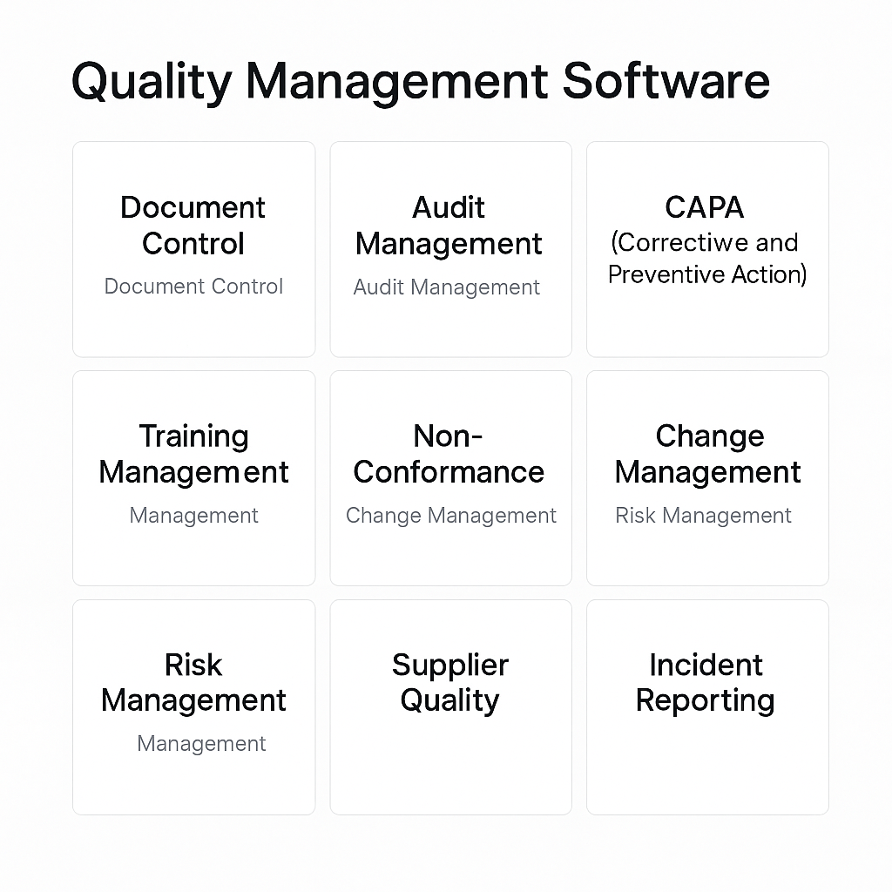
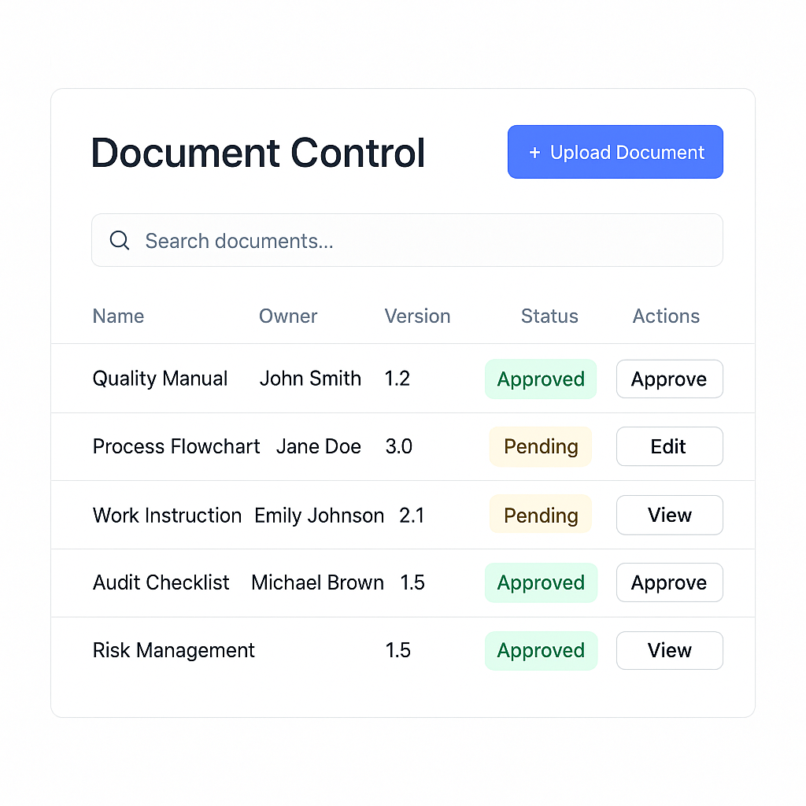
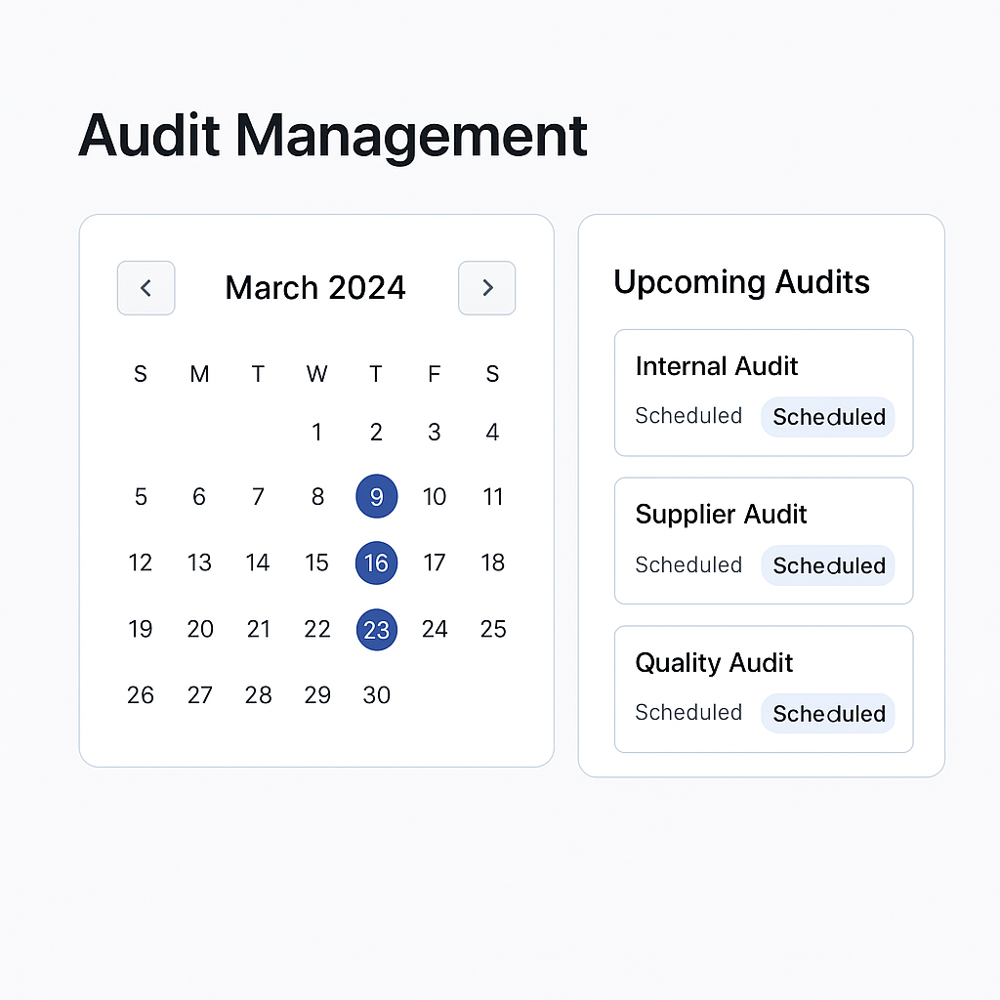
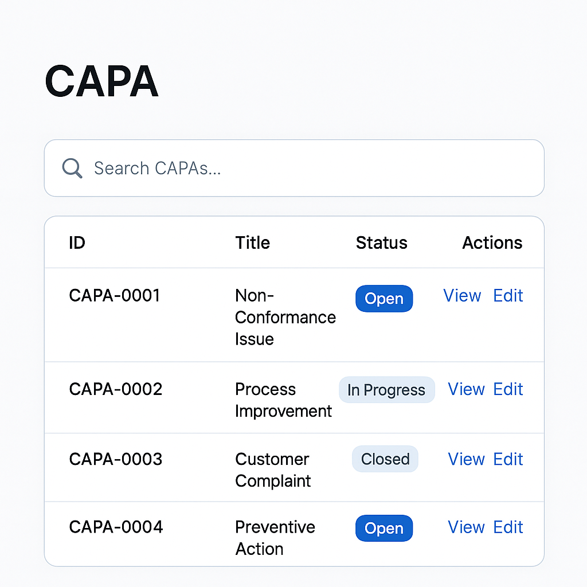

# Project Title

A Quality Management System (QMS) application designed to streamline and enhance quality processes.

## Overview

This project is a web-based application that helps organizations manage their quality processes efficiently. Below are the design mockups to give you a visual understanding of the application:

### Design Mockups





## Tech Stack

### Frontend
- **React**: For building the user interface.
- **Redux Toolkit**: For state management.
- **TailwindCSS**: For styling.

### Backend
- **Go**: For server-side logic.
- **Gin Framework**: For building RESTful APIs.
- **PostgreSQL**: For database management.

## Features
- User-friendly interface for managing quality processes.
- Robust backend with secure API endpoints.
- Responsive design for seamless use across devices.

## Getting Started

### Prerequisites
- Node.js
- Go
- PostgreSQL

### Installation
1. Clone the repository:
    ```bash
    git clone https://github.com/NaimBiswas/qms.git
    ```
2. Navigate to the project directory:
    ```bash
    cd qms
    ```
3. Install frontend dependencies:
    ```bash
    cd frontend
    npm install
    ```
4. Set up the backend:
    ```bash
    cd backend
    go mod tidy
    ```

### Running the Application
- Start the frontend:
  ```bash
  npm start
  ```
- Start the backend:
  ```bash
  go run main.go
  ```

## License
This project is licensed under the MIT License.

## Contact
For any inquiries, please reach out to [nayeembiswas2@gmail.com].